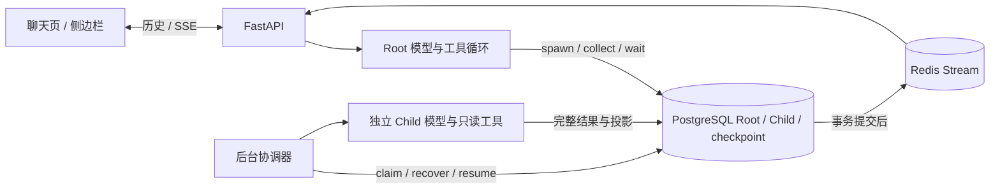

# 架构说明

状态：active

CornAgent 由 React 前端、FastAPI 服务、PostgreSQL 和 Redis 组成。前端展示对话与工具执行过程；服务端管理运行状态、调用模型并执行工具。PostgreSQL 是持久状态的事实来源，Redis 负责实时事件传输与有限重放。

## 模块分工

| 模块 | 职责 |
| --- | --- |
| `frontend/src/agent` | 聊天页、侧边栏、输入框、附件、问题卡、Markdown 与 SSE 状态同步 |
| `frontend/src/api` | JSON 请求、幂等重试与事件流传输 |
| `frontend/src/components/sidebar` | 首页、聊天历史、语言、主题与折叠导航 |
| `frontend/src/i18n` | 有类型检查的中英文文案及状态提示翻译 |
| `server/app/api/routes` | 会话、消息、运行、问题回答与文件 API |
| `server/app/agent` | 模型接入、运行编排、上下文压缩、工具执行与事件发布 |
| `server/app/persistence` | 数据模型、事务、消息树、checkpoint 与租约 |
| `server/app/object_store.py` | 私有本地文件系统与 S3 兼容存储 |
| `server/migrations` | Alembic 数据库版本管理 |

## 一次对话如何执行

1. 前端提交消息和幂等键，服务端在同一事务创建消息与 Run。
2. 运行器获取租约，读取会话上下文，调用模型并执行工具。
3. 状态先提交 PostgreSQL，再将增量事件发布到 Redis Stream。
4. 前端通过 SSE 更新回复、思考过程、工具结果与问题卡。
5. 需要用户补充信息时，`ask_user` 保存问题并暂停 Run；收到回答后从 checkpoint 继续。

页面刷新后读取数据库快照，再接续增量事件。服务重启后，后台 reconciler 检查过期租约并从安全边界恢复。具体状态与失败语义见 [运行时](runtime.md)。

## 前端组织

应用入口组合路由、导航和共享工作区，独立聊天页与 Agent 面板复用会话、输入和渲染组件。桌面导航支持调整宽度、折叠与悬停预览；窄屏使用带焦点管理的抽屉。主导航展示首页、侧边栏示例、Agent 渲染效果与聊天分组；面板示例通过 `/sidebar` 访问，消息渲染演示通过 `/rendering` 访问。演示复用正式 Markdown 渲染器和共享 Provider，仅在本地播放合成内容。

`CornAgentProvider` 统一提供主题、语言与工作区；`AgentLauncher` 和 `AgentSidebar` 直接使用同一上下文。使用方从 `frontend/src/agent/index.ts` 导入公共组件，配置一个 API 前缀即可对接 JSON、SSE 和附件访问，见 [前端接入](frontend-integration.md)。

语言与主题在展示层切换，并保存在当前浏览器；切换时保持工作区和 SSE 订阅稳定。界面文案使用字典和命名占位符，用户、模型及文件内容保留原文。开发约定见 [前端说明](../frontend/README.md)。

## 数据与工具

持久化模型包含 Session、Message、Run、Question、File、MessageFile 和 SubagentTask。消息树支持重新生成与版本切换，文件通过有序引用关联到消息。

内置 `ask_user`、`read_file`、Tavily `web_search`、Jina Reader `read_url` 及五个 Root 专用子任务编排工具。工具在 `server/app/agent/tools` 注册，由统一执行器处理调用与结果。`read_file` 只读取当前会话的 PDF，私有正文在模型请求期间物化，持久状态保存引用与脱敏结果。

文件元数据和处理状态存入 PostgreSQL，原文件保存于私有本地目录或 S3 兼容桶。上传、完整性校验和回收策略见 [文件存储](storage.md)。

## 配置与部署

根目录 `.env` 是统一配置入口，完整模板见 [.env.example](../.env.example)。系统环境变量优先于文件值。模型密钥、数据库连接和对象存储凭据只在服务端使用。

开发环境由 Vite 将 `/api` 代理到 FastAPI；生产构建可直接由 FastAPI 同源托管。应用默认使用固定工作区，宿主系统负责对外访问控制。运行步骤见 [README](../README.md)。

## 子任务编排

`server/app/agent/subagents` 管理通用协议、五个编排工具、独立 Child 模型循环与后台协调；`server/app/persistence/subagents.py` 管理队列、结果收件箱和原子交付。Child 使用独立租约，Root 暂停不会中断 Child；Root 与 Child 共享实例执行名额，等待时释放名额。每 Root 并行上限通过 PostgreSQL Root 行锁在多个实例之间协调。

模型轮次边界读取数据库结果状态；必需任务未解决时暂存候选输出，必要时自动收取/等待后重新生成答案，最终提交再进行事务检查。前端使用稳定标识更新 `tool_call` 子任务投影，不新增 Child 聊天页。协议、工具扩展、配置与归档来源见 [子任务说明](subagents.md)。
